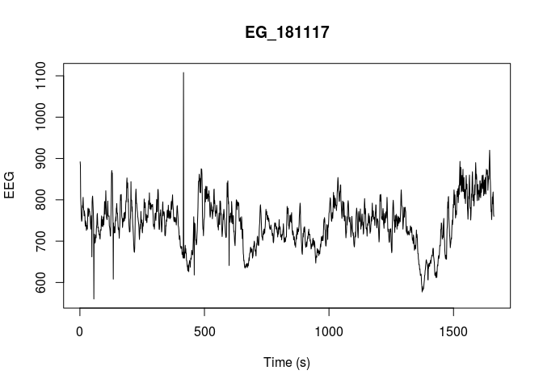
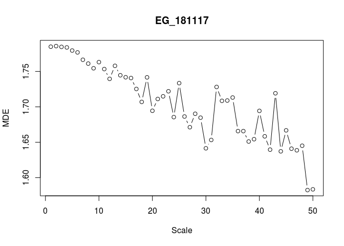

<!-- README.md is generated from README.Rmd. Please edit that file -->

# MSEntropy

<!-- badges: start -->

[](https://www.tidyverse.org/lifecycle/#experimental)
<!-- badges: end -->

The goal of MSEntropy is to provide a set of optimzed multiscale entropy
calculation functions.

## Installation

You can install the development version from
[GitHub](https://github.com/) with:

``` r
# install.packages("devtools")
devtools::install_github("jcaude/MSEntropy")
```

## Example

The MSEntropy package comes with some sample datasets:

``` r
library(MSEntropy)
#> Loading required package: tuneR
#> Loading required package: parallelMap

## basic example code
plot(EG_181117,type='l',xlab="Time (s)", ylab="EEG",main="EG_181117")
```

 You can than
compute the Multiscale Dispersion Entropy (MDE)
using:

``` r
plot(MDE(EG_181117,scales = 1:50),type='b',xlab="Scale",ylab="MDE",main="EG_181117")
```


